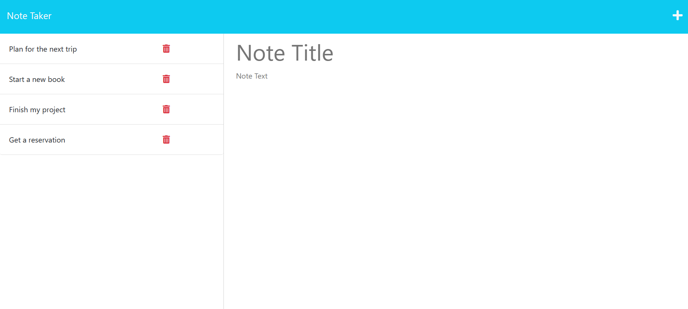
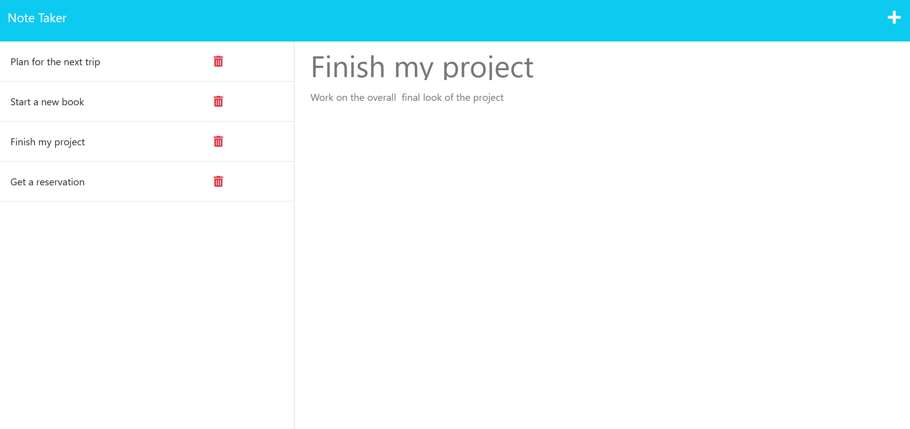

# Express.js Challenge: Note-Taker
## Table of Content
- [Description](#description)
- [Links](#links)
- [Screenshots](#screenshots)
- [Installation](#installation)
- [Test](#test)
-------------------------------------
## Description
For this application a starter code was provided i.e the front end has already been created. The task was to build the back end of the application, connect it to the front end and deploy the entire application to Heroku. 
The application is used to write and save notes. By using Express.js and JSON file, this app lets a user save and retrive notes from db.json file. For this app to be functional GET, POST and DELETE Api routes were implemented to read and return saved notes, as well as delete a note with the given ID property. 

## Links

Deployed app URL: https://radiant-beyond-71767.herokuapp.com/

## Screenshots

## Installation

    ​npm install express
    ​  
## Test 

    node server.js  or npm start
-----------------------------------
&copy; 2023